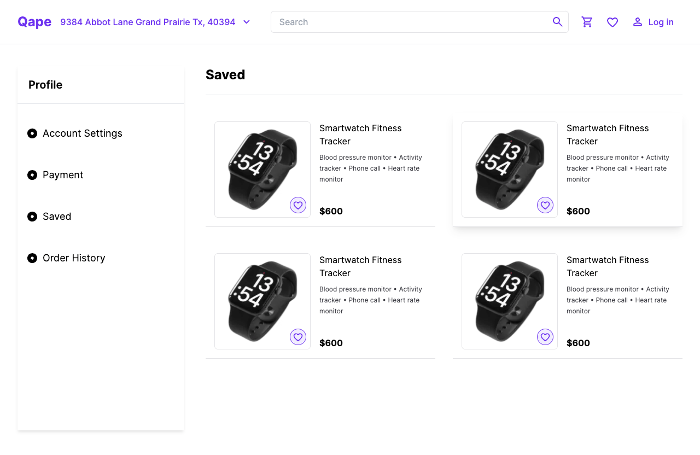

# eCommerce Landing Page using Tailwind CSS and StorefrontUI/React in Next.js

This project is an eCommerce landing page built using **Tailwind CSS** and the **StorefrontUI/React** library in **Next.js**. The goal of this project is to create a visually appealing and interactive eCommerce website that showcases products and provides a seamless user experience.

## Demo

You can view the live demo of the eCommerce landing page at [https://storefrontui-figma.vercel.app/](https://storefrontui-figma.vercel.app/).

## Project Description

The landing page consists of the following key components:

### Navbar

The navigation bar appears at the top of the page and includes the logo, menu items, search functionality, and a shopping cart icon. It provides easy navigation for users to explore different sections of the website.

### Sidebar

The sidebar is located on the left side of the page and displays various categories or options for users to filter or browse through products. It enhances the user experience by providing quick access to different product categories.

### Hero Section

The hero section is the main focus of the landing page and showcases four featured products. Each product is displayed with an image, title, price, and an "Add to Cart" button. Users can easily view product details, add items to their cart, and proceed to checkout.

The project utilizes the **Tailwind CSS** framework to style the components, providing a responsive and modern design. **StorefrontUI/React** is used to integrate pre-built eCommerce components and provide a consistent UI experience. **Next.js** is chosen as the framework to build the project, allowing for server-side rendering, better performance, and easier deployment.

## Running the Project Locally

To run the project locally, follow these steps:

1. Clone the repository.
2. Install the dependencies using `npm install` or `yarn install`.
3. Run the development server using `npm run dev` or `yarn dev`.
4. Open your browser and visit `http://localhost:3000` to view the eCommerce landing page.

Feel free to explore and modify the project as needed to suit your requirements and showcase your skills in front-end development and eCommerce website design.

